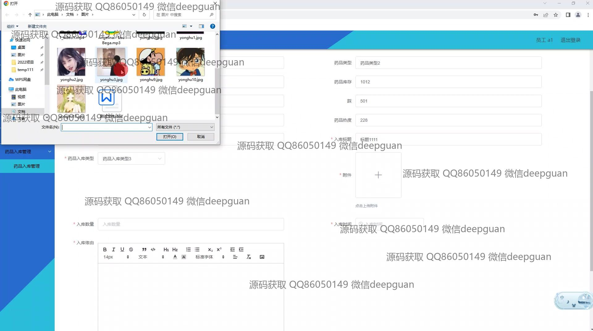
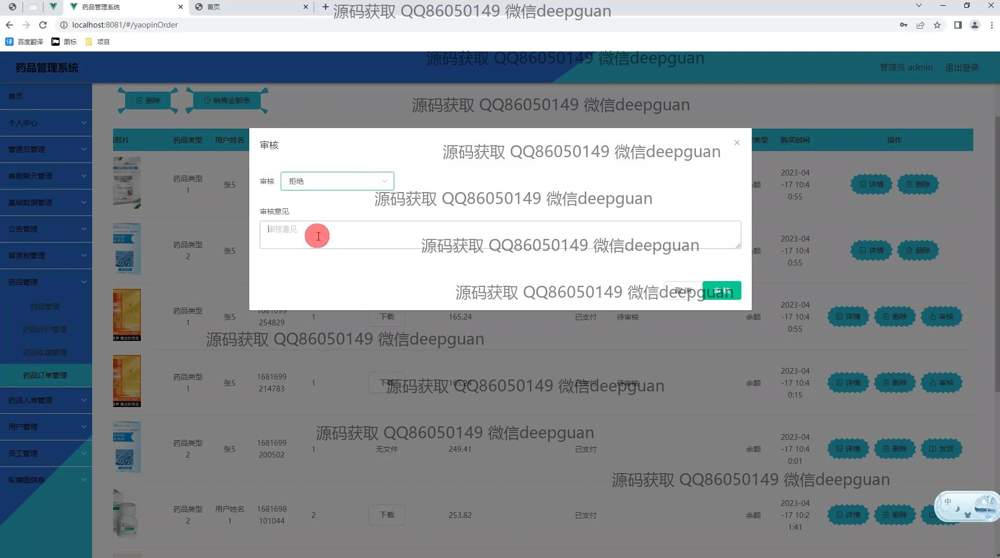

<h1 align="center">药品管理系统</h1>

## 简介
药品管理系统：角色分为管理员、用户；功能包括用户信息管理、药品订单确认、库存管理、客服聊天、留言管理、药品入库与审核、统计报表和注册登录。    --计算机毕业设计源码；毕设源码；java毕业设计源码

## 联系方式

<h3 align="center">获取完整代码与数据库文件 + 微信：deepguan QQ: 86050149 QQ群: 783742310</h3>

<h3 align="center">可帮忙远程部署 包运行成功！提供远程部署、修改代码、设计文档指导、代码讲解等服务！</h3>

## 功能介绍（完整见运行截图）
管理员：系统为管理员提供全面的管理功能，包括用户管理、药品管理、订单管理以及客服聊天管理等。管理员可以通过导航栏模块进行用户信息的查看与修改、药品入库与库存管理、订单的审批与发货处理。系统还允许管理员上传相关图片用于公告和轮播图展示，并提供数据统计报表功能。管理员可以通过简单的UI界面高效管理药品信息，及时进行各项审批，确保系统的稳定运行。

用户：用户在系统中可以注册、登录、浏览药品信息，并通过购物车进行下单和结算。用户在个人中心可以查看和修改个人信息，管理收货地址、订单以及药品收藏。系统提供搜索功能，让用户能够快速查找所需药品，并通过订单管理功能查看和管理历史订单。为了确保用户的药品安全购买，还须上传医生证明以获取处方药。用户可以通过留言板与管理员沟通，或使用客服功能获取即时帮助。

## 运行截图

本代码来源于网络,仅供学习参考使用!

